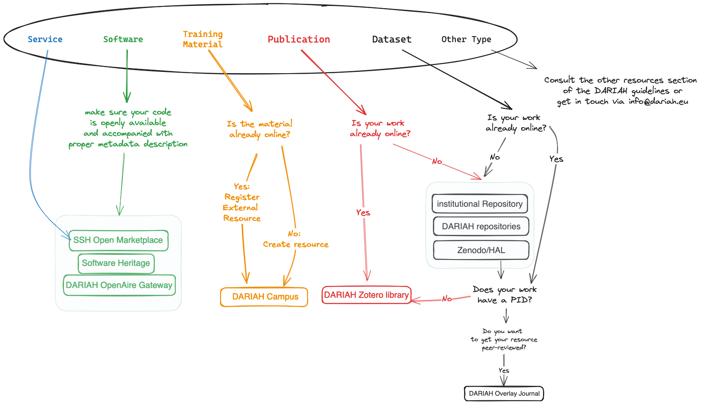

# **DARIAH resources pathways** {#dariah-resources-pathways}

Different pathways exist to add resources to the EU landscape and DARIAH environment. This section details, for six main content types \- services, data sources, software, publications, datasets and training materials \- what are these different options, and what kind of questions can guide one to decide on the best pathway for their resources.

Different pathways are relevant for different actors depending on their role (resource creator, service provider, ...). For example, a repository manager will want to integrate their repository as a data source, while a researcher will want to share a dataset created during a research project funded under the DARIAH theme. These guidelines are covering most of the use cases encountered by the DARIAH community so far, but can and should be extended to encompass new resource types or additional activities carried out by the various actors.

The following table provides a condensed overview of the pathway steps together with pointers to description of respective services. Fig 02 depicts graphically these same pathway steps.

| Resource Type | Corresponding Services | Pathways (1,2 \= sequence, A,B,C \= alternative options) |
| :---- | :---- | :---- |
| Service | [SSH Open Marketplace](#ssh-open-marketplace) [DARIAH tools & services catalogue](https://www.dariah.eu/tools-services/tools-and-services/) | 1) Onboard the service in the SSH Open Marketplace. 2) Service is (automatically) listed in the [DARIAH tools & services catalogue](https://www.dariah.eu/tools-services/tools-and-services/) |
| Data source | [DARIAH OpenAire Community Gateway](#dariah-openaire-gateway) [SSH Open Marketplace](#ssh-open-marketplace) [DARIAH Campus](#dariah-campus) | Depending on the content types a data source hosts, the options are: A) if the data source hosts or aggregates mostly publications and/or dataset, it should disseminate the metadata in the DARIAH OpenAire Community Gateway. B) If the data source exposes metadata about services, software and tools, the products should be available in the SSH Open Marketplace (automated pipeline or manual addition). The products should clearly indicate their relation to relevant services, software and tools. C) If the data source hosts training materials, these should be added to DARIAH Campus as external resources or SSH Open Marketplace (see details in 3.3). |
| Software | [Zenodo (DARIAH Community)](#zenodo-\(dariah-community\)) ; [Software Heritage](#software-heritage) | Pre-condition: software code needs to be available online. For example, use Zenodo (DARIAH Community) or GitHub. Adding metadata about your software to the [SSH Open Marketplace](). |
| Publication | [DARIAH recommended repositories](#dariah-recommended-repositories) [DARIAH Zotero Library](#dariah-zotero-library) [DARIAH OpenAire Community Gateway](#dariah-openaire-gateway) [Transformations. A DARIAH Journal](#dariah-overlay-journal---transformations)  | Pre-condition: publication is deposited or published (see here for the list of DARIAH recommended repositories). 1) Add the bibliographical record to the DARIAH Zotero library. All DARIAH publications should be added to this DARIAH Zotero library 2) If it has a PID, link the publication to the DARIAH OpenAire Community Gateway 3) Submit publication for peer review in [*Transformations. A DARIAH Journal*](https://transformations.episciences.org/) |
| Dataset | [DARIAH recommended repositories](#dariah-recommended-repositories) [HAL DARIAH](https://hal.science/DARIAH) or [Zenodo (DARIAH Community)](#zenodo-\(dariah-community\)) [Transformations. A DARIAH Journal](#dariah-overlay-journal---transformations) | 1) Deposit your work in a repository A) Ideally a DARIAH recommended repository B) HAL or Zenodo C) any other institutional repository which issues PIDs 2) Link your dataset to the DARIAH OpenAire Community Gateway 3) If suitable, submit publication for peer review in *Transformations. A DARIAH Journal* |
| Training Material | [DARIAH Campus](#dariah-campus) [SSH Open Marketplace](#ssh-open-marketplace) | A) Publish training materials directly in DARIAH Campus B) Publish on DARIAH-Campus a reference to a resource available in another system (institutional/national or discipline specific LMS/e-learning system) as an external resource. C) If the material is not suitable for DARIAH Campus, add it as training material to the SSH Open Marketplace (see details in 3.3) |
| Other (digital) resources, such as: notebooks, semantic artefacts, standards, workflows… | [SSH Open Marketplace](#ssh-open-marketplace) [DARIAH OpenAire Community Gateway](#dariah-openaire-gateway) [Transformations. A DARIAH Journal](#dariah-overlay-journal---transformations) | A) Register the resource as "tools & services" in the SSH Open Marketplace B) link your resource to the DARIAH OpenAire Community Gateway OpenAire B) If suitable, submit publication for peer review in *Transformations. A DARIAH Journal. Narrative workflows may also be created directly in the SSH Open Marketplace* |

The following diagram \- figure 02 \- offers a simplified view of the main decisions involved in the management of DARIAH resources pathways

[Source](https://excalidraw.com/#room=09bf848438bafb05ffc6,jnNx_oo32SdXZvooInZtPw)

*Fig 02 \- DARIAH resources pathways \- decision paths*
