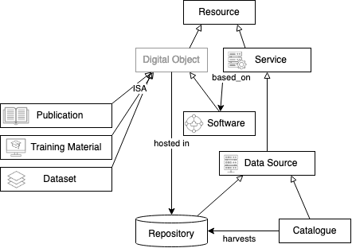

# **Introduction**

The distributed and polymorphic nature of DARIAH as a consortium, and its social and technical components as an infrastructure makes it non-trivial to define its perimeter. The term ***"DARIAH resource"*** does not indicate direct ownership or control by the DARIAH consortium over that resource but rather some actor (person or institution) within the broad ecosystem of DARIAH being involved in the creation or provision of that resource.

A large majority of DARIAH resources are produced or offered by individual institutions in the member countries and reported by their respective national consortia as their in-kind contributions to the infrastructure. Besides that, there are resources produced under DARIAH activities by DARIAH Working Groups, funded by DARIAH Theme or by DARIAH and affiliated entities within EU projects.

We distinguish 6 main DARIAH resource types:

| Resource Type | Generic definition[^1] | DARIAH scope |
| :---- | :---- | :---- |
| Publication | Research results published in academic journals or non-peer-reviewed publication repositories such as Zenodo. Example: [10.4000/jtei./4460](http://journals.openedition.org/jtei/4460)  | One of the following applies: result of work in a national consortium or working group funded by DARIAH-EU or a national consortium  a DARIAH-affiliated tool or resource is \*cited/used in them It is written/created by authors affiliated to DARIAH bodies or national consortia. it is about DARIAH/CLARIAH |
| Dataset | A dataset is a digital object or a collection of digital objects that is generally considered a distinctive body of work. Example: [https://marketplace.sshopencloud.eu/dataset/pNFLh2](https://marketplace.sshopencloud.eu/dataset/pNFLh2) |  |
| Training Material | Tutorials, lessons or didactic resources with specific learning outcomes, e.g. explaining how to use a tool. Example: [https://campus.dariah.eu/resources/hosted/data-and-databases-from-source-to-data](https://campus.dariah.eu/resources/hosted/data-and-databases-from-source-to-data)  |  |
| Software | Source code or software package developed and/or used in a research context\*Note:* In distinction to services, which are available as web applications or APIs and can be used directly, software needs to be downloaded and installed or executed on the side of the user, to be used. Example: [https://marketplace.sshopencloud.eu/tool-or-service/i6piia](https://marketplace.sshopencloud.eu/tool-or-service/i6piia)  |  |
| Service | Web application or API which can be accessed online/via Internet. Example: [https://marketplace.sshopencloud.eu/tool-or-service/VjLUsM](https://marketplace.sshopencloud.eu/tool-or-service/VjLUsM) | Service owned by DARIAH-ERIC, DARIAH partner institutions or coming from a DARIAH-related project. See Service policy for inclusion criteria. |
| Data source | A Data Source is a specific service that exposes data and metadata about different types of Digital Objects. Examples of data sources are repositories, digital libraries, scientific databases, catalogues, etc. Example: [HAL](https://hal.science/DARIAH) or [https://marketplace.sshopencloud.eu/tool-or-service/hqXyOo](https://marketplace.sshopencloud.eu/tool-or-service/hqXyOo) |  |

*Fig 01: DARIAH resources conceptual view*

To collect information about DARIAH Resources, specific "pathways" are proposed describing flow of information about different types of resources between existing components of the broader ecosystem. They allow us to gather existing information about the resources, from wherever it is already available, eliminating the need to enter the same information multiple times. The pathways are governed by two premises:

1) make maximal use of existing infrastructure components (repositories, catalogues, registries, etc.), primarily in the Data Spaces (EOSC or DS4CH) context
2) capture the breadth of the field, not disqualifying resources (esp. software and services) which may be not mature enough for the primary pathway.

Individual pathways are detailed in the present *Guidelines for managing DARIAH resources*. While section 2 "DARIAH resources pathways" provides an overview of the pathways per resource types, section 3 "Services used for managing DARIAH resources" includes detailed guidelines on how to use the various services involved in all the pathways.

Complementary to these Guidelines, there are a number of further relevant policy documents that govern the management of DARIAH resources, especially the DARIAH Services and DARIAH Data policy.

[^1]:  EOSC is serving as a reference frame, we aim to align the categorisation of resources with that devised in EOSC, and in the SSH Open Marketplace (catalogue from the SSH Open Cluster. Definitions are coming from the SSH Open Marketplace items types) ([https://marketplace.sshopencloud.eu/about/data-population#types-of-content),](https://marketplace.sshopencloud.eu/about/data-population#types-of-content) from the EOSC-EU Node resource catalogue ([https://madgeek-arc.github.io/resource-catalogue-docs/](https://madgeek-arc.github.io/resource-catalogue-docs/))  and from the OpenAIRE types ([https://monitor.openaire.eu/methodology/terminology#entities](https://monitor.openaire.eu/methodology/terminology#entities))
