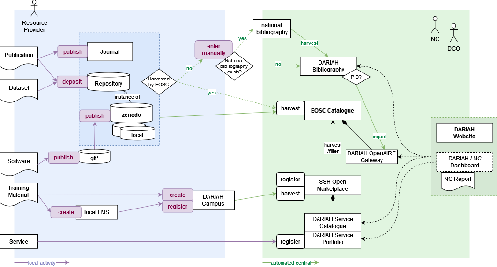

## Annexes

The following diagram illustrates the various pathways per resource type, showing which sources of information are considered and how the information flow between registering and reporting DARIAH resources is envisioned.

Annex 1 DARIAH resources pathways \- information/data flow {#annex-1-dariah-resources-pathways---information/data-flow}

Resource Catalogue Documentation \[v5.3.0\] [https://madgeek-arc.github.io/resource-catalogue-docs/](https://madgeek-arc.github.io/resource-catalogue-docs/) (accessed January 2026\) 

EURISE Technical Reference: [https://technical-reference.readthedocs.io/en/latest/](https://technical-reference.readthedocs.io/en/latest/) (accessed April 2024\)
