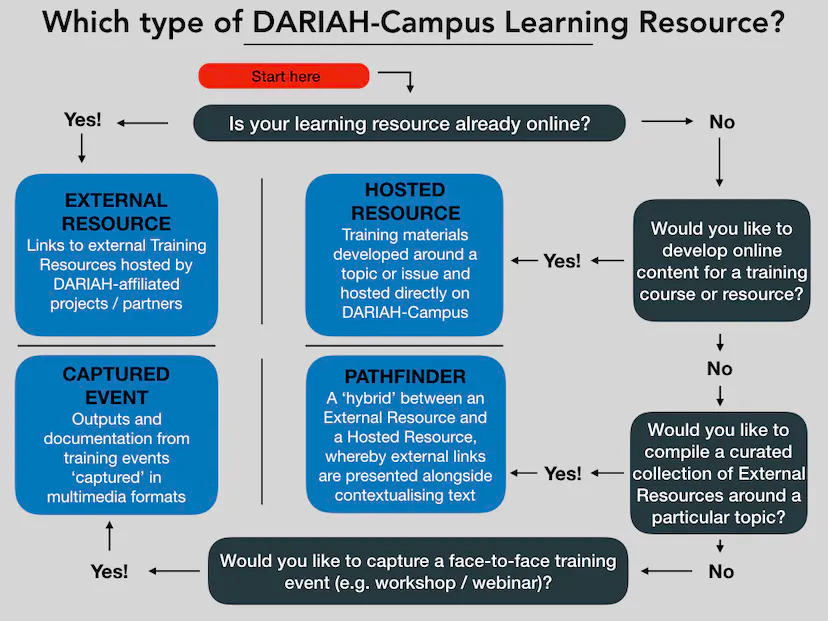

 ## DARIAH-Campus

[**https://campus.dariah.eu**](https://campus.dariah.eu/docs/proposing-a-contribution)

DARIAH-Campus is both a *discovery framework* and a *hosting platform* for DARIAH and DARIAH-affiliated offerings in training and education. It is the central catalogue for training materials in the context of DARIAH

The goal of DARIAH-Campus is to widen access to open, inclusive, high-quality learning materials that aim to enhance creativity, skills, technology and knowledge in the digitally-enabled arts and humanities.

Within DARIAH-Campus, users can find different types of **learning resources:**

* external resources   
* hosted resources  
* pathfinders

and **captured outputs of face-to-face events** run by members of the community.

  

## The route to publication on DARIAH-Campus
DARIAH-Campus is hosted on GitHub, making it versionable and open to contributions.  However, it requires permissions in order to allow contributions, and this is given as part of the editorial process.
In the first instance, users should head to the documentation on the Campus website, which gives information about how to make a contribution via the GitHub interface (Guidelines: https://campus.dariah.eu/documentation/proposing-a-contribution) 
