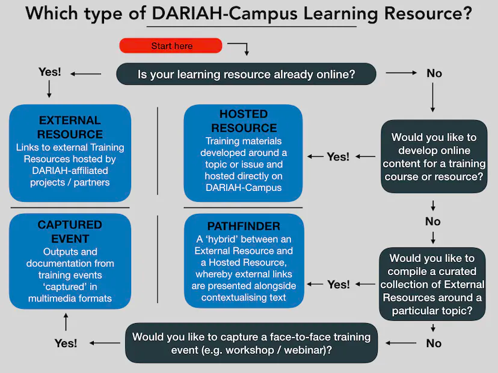

## DARIAH-Campus

[**https://campus.dariah.eu**](https://campus.dariah.eu/docs/proposing-a-contribution)

DARIAH-Campus ([**https://campus.dariah.eu**](https://campus.dariah.eu/)) is both a *discovery framework* and a *hosting platform* for DARIAH and DARIAH-affiliated offerings in training and education. The goal of DARIAH-Campus is to widen access to open, inclusive, high-quality learning materials that aim to enhance creativity, skills, technology and knowledge in the digitally-enabled arts and humanities. It is the central catalogue for training materials in the context of DARIAH. The curatorial and editorial process is conducted manually in collaboration with the DARIAH-Campus Editorial Team, ensuring that your resource is published in the highest quality.

Within DARIAH-Campus, users can find different types of **learning resources:**

* hosted resources
* captured events
* external resources
* pathfinders

and **captured outputs of face-to-face events** run by members of the community.

 

It is recommended that all training materials coming from the DARIAH Community are published (as either hosted or external resources) to DARIAH-Campus in the first instance, and from there they will be ingested as part of an automated process into the SSH Open Marketplace, thus ensuring recognition and promotion of materials via two platforms while only having to complete the requirements of DARIAH-Campus.

DARIAH Campus requires specific metadata for training resources as well as explicit learning outcomes. If you have training resources which are not equipped with appropriate metadata, and you don't have the capacity to provide these or are unsure about how to proceed, please feel free to speak to a member of the DARIAH-Campus Editorial Team. Where appropriate, the Marketplace may serve as an alternative path.

## The route to publication on DARIAH-Campus

DARIAH-Campus is hosted on GitHub, making it versionable and open to contributions. However, it requires permissions in order to allow contributions, and this is given as part of the editorial process.

In the first instance, users should head to the documentation on the Campus website, which gives information about how to make a contribution via the GitHub interface (Guidelines: [https://campus.dariah.eu/documentation/proposing-a-contribution](https://campus.dariah.eu/documentation/proposing-a-contribution)). From here you can determine what format your resource will be published in (hosted, event, external or pathfinder). You can follow the instructions in the documentation to submit a proposal for a resource. At this point a member of the DARIAH-Campus Editorial Team will get in touch with you, if you haven't already spoken to them, to arrange a call to discuss your proposal. Once approval has been given, you will be granted 'write' permissions to the repository on GitHub, and from there you will be able to access the content management system to draft up your resource.
