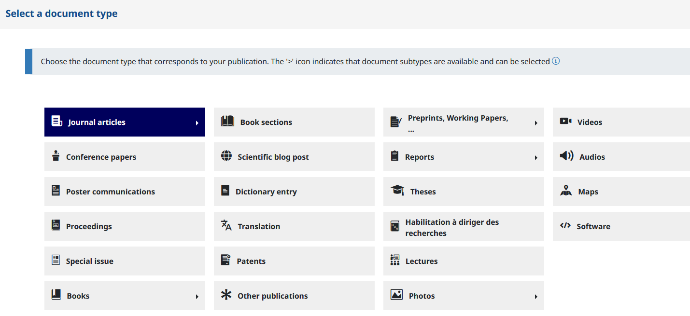
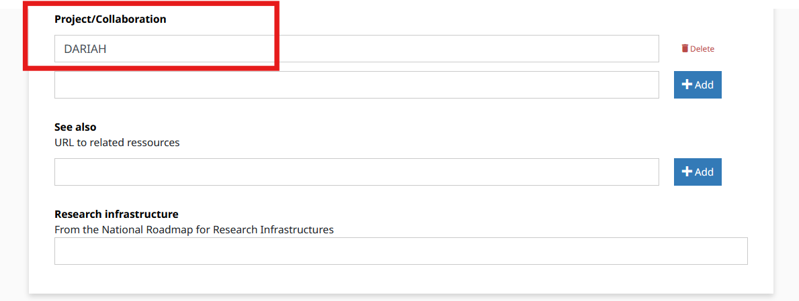
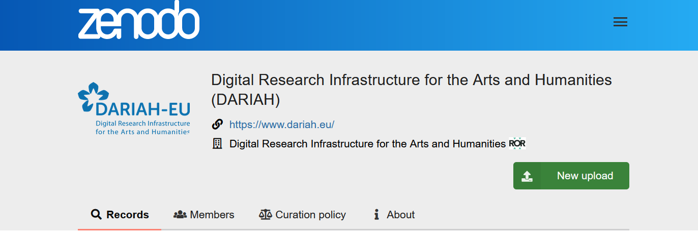
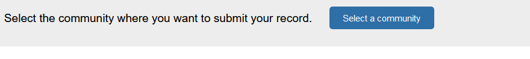
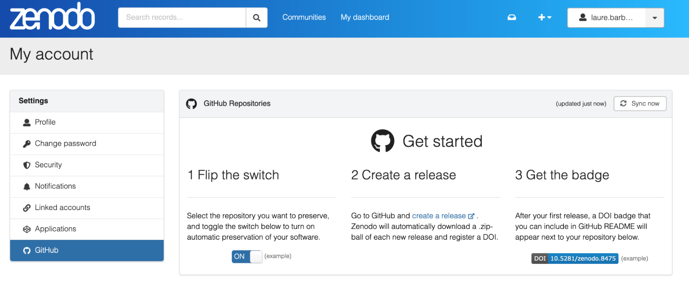

## DARIAH recommended repositories

According to the [DARIAH Data Policy](https://zenodo.org/records/14515142), we recommend using an institutional repository, if available and if required by your institutional data sharing policies, or, alternatively use: 

* one of the DARIAH affiliated repositories (section 3.2.1),   
* DARIAH HAL collection (section 3.2.2)   
* DARIAH Zenodo Community (section 3.2.3)

  1. ### DARIAH repositories 

DARIAH members and partners contribute to the DARIAH infrastructure with a diverse range of resources, most known data sources are repositories and are services declared by DARIAH National Coordinators. All [DARIAH repositories](https://www.dariah.eu/tools-services/tools-and-services/?tab=dh-tab-1&categories%5B%5D=repository&searchStr=) can be found browsing the DARIAH service catalogue.

2. ### HAL (DARIAH Collection)

DARIAH offers researchers in the arts and humanities to use the HAL **publication repository**: [**https://hal.science/DARIAH**](https://hal.science/DARIAH).

1. #### Log in to [HAL DARIAH collection](https://hal.science/DARIAH)

If you already have a HAL account, sign in to [https://hal.science/DARIAH](https://hal.science/DARIAH). If it is the first time you use HAL, you will need to create an account: [https://hal.science/user/create](https://hal.science/user/create). 

2. #### Upload and describe resource

Click on UPLOAD (top right of your screen), choose your document type and provide metadata about the resource

 

3. #### Add ‘DARIAH’ to Project collaboration metadata field

Whatever the type of document, you will find this field in “In Other informations”.

 

You can also add or create your DARIAH national Project/Collaboration to your deposit (e.g DARIAH-BE, DARIAH-CH, DARIAH-HR…).

3. ### Zenodo (DARIAH Community)

The DARIAH Zenodo Community \- [**https://zenodo.org/communities/dariah/**](https://zenodo.org/communities/dariah/) \- brings together and accepts outputs (partially or entirely) of collaborations within and across the DARIAH networks (such as the DARIAH Working Groups, Theme funding calls or National Consortia), or contributions that are related to DARIAH’s activities in any other way.

Submissions to the community require review performed by the curators, managers or owners (i.e. DARIAH DCO team members) of the community.

1. #### Log in to [**DARIAH Zenodo Community**](https://zenodo.org/communities/dariah/)

 

2. #### And then simply go to **New upload**, and here, you will have to login to Zenodo ![][image6]

3. #### Select DARIAH as Community

   If you connect directly to Zenodo (generic), you will have to select DARIAH in the communities banner at the top of the upload screen.

 

You will have to write DARIAH in full \- Digital Research Infrastructure for the Arts and Humanities \- and not only the acronym.

 

Note that you can add multiple communities to your deposits at the same time.

If you would like to add records to the DARIAH collection that are already published on Zenodo, you should go to ‘Upload’ and then click on the record(s) you would like to add to the DARIAH community. Unfortunately, if you are not the depositor of the record, you will not be able to modify it even if you are one of the authors.

#### 

#### Publishing a software from GitHub to Zenodo

By following this [tutorial](https://docs.github.com/en/repositories/archiving-a-github-repository/referencing-and-citing-content) \- it is possible to archive a GitHub repository to Zenodo.

 

Then, in the same way that for any Zenodo deposit (see previous section), you will be able to select the DARIAH community when creating the record for the release of your software. 
