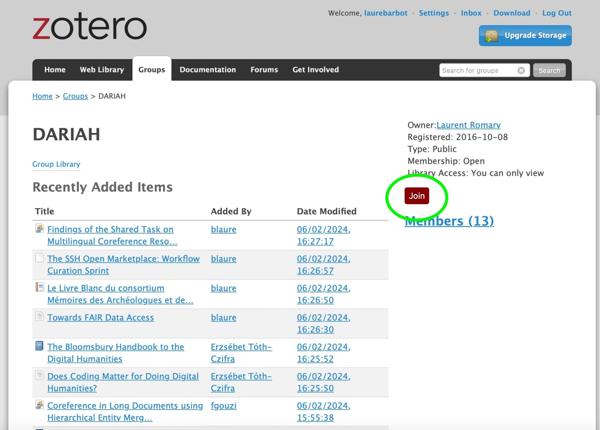
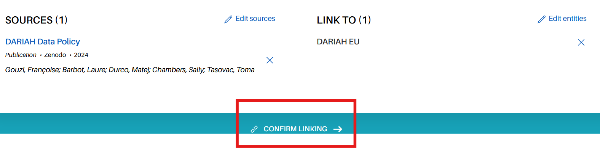
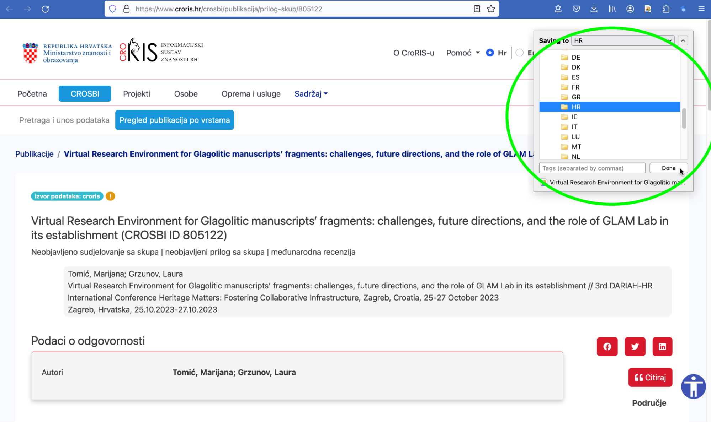

## DARIAH Zotero Library

DARIAH maintains a Zotero Group Library \- [https://www.zotero.org/groups/744474/dariah/library](https://www.zotero.org/groups/744474/dariah/library) \- in which DARIAH publications are being compiled. It is structured into collections per DARIAH member country and per DARIAH Working Groups.

Zotero comes with a good documentation \- [https://www.zotero.org/support/](https://www.zotero.org/support/) \- so the following guidelines only highlight the specific steps on how to add DARIAH national resources to Zotero, pointing to the existing documentation where necessary.

1. ### Log in or register to Zotero

If you already have a Zotero account, log in via [https://www.zotero.org/user/login/](https://www.zotero.org/user/login/). If it is the first time you use Zotero, you will need to create an account: [https://www.zotero.org/user/register](https://www.zotero.org/user/register). 

Note that it is also possible to work with Zotero using a local client ([https://www.zotero.org/support/installation](https://www.zotero.org/support/installation)). This will allow you, for example, to install the Zotero connector in your web browser and may make the following steps easier (but it is not necessary either)\!

2. ### Join the DARIAH Zotero Group 

**The DARIAH Zotero Group is available at: [https://www.zotero.org/groups/744474/dariah](https://www.zotero.org/groups/744474/dariah)** (you might encounter other DARIAH related Zotero groups \- [https://www.zotero.org/search/type/group?q=dariah](https://www.zotero.org/search/type/group?q=dariah) \- but please use the above mentioned one).

Once you are logged in, visit the DARIAH Group and click on join, this will allow you to view and **edit** the records in the group. You only need to do this once. After joining, you can find the DARIAH group library in your personal library by logging into Zotero as per the above instructions.

  
 
*Joining the DARIAH Group*

3. ### Add publications to your national or WG folder

It’s crucial to curate the bibliographic data and pay specific attention to **‘DOI’ and ‘Rights’** metadata/field when you will fill out publications in your particular folder.

See Zotero documentation to understand how to manually add items to the Group Library: [https://www.zotero.org/support/adding\_items\_to\_zotero\#manually\_adding\_items](https://www.zotero.org/support/adding_items_to_zotero#manually_adding_items)

Go to the DARIAH Group Library: [https://www.zotero.org/groups/744474/dariah/library](https://www.zotero.org/groups/744474/dariah/library)

  
 
*DARIAH Group Library screenshot*

1. #### Adding publication via your browser with the Zotero connector

“The Zotero Connector's save button is the most convenient and reliable way to add items with high-quality bibliographic metadata to your Zotero library. As you browse the web, the Zotero Connector will automatically find bibliographic information on webpages you visit and allow you to add it to Zotero with a single click.” 

  
*Save to Zotero via the connector \- step 1*

  

*Save to Zotero via the connector \- step 2* 

#### 

2. #### Manually adding publication with identifier

It is also possible to add items manually via the DARIAH Zotero Library (i.e. without the connector).

If your resources have an Identifier \- ISBN, DOI, PubMed ID, arXiv ID, or ADS Bibcode \- it is really straightforward to add them to the library using this button ![][image14]\! This way, Zotero can also sometimes automatically identify resources based on a URL, e.g. to a publication page such as [this](https://journals.uio.no/dhnbpub/article/view/10650).

  

4. ### Manually adding publication without identifier

It is also possible to manually add items using the following button:   

If you have downloaded the client, you can also use the import functions to create a record.

5. ### Copying records from other libraries

Some countries \- it is the case for Italy or Germany for example \- or Working Groups are maintaining their own Zotero library. In this case, DARIAH related records can be copied directly between libraries. To do so, simply drag the selected record(s) from the source library to the target national/WG collection of the DARIAH Group Library (adding records to a new location will not remove them from the old one). If using Zotero online, you can also copy records by selecting the records you want to transfer, clicking the “Add to collection” button \  \] , and then selecting your country collection. 

6. ### Bulk imports

You can also import records in bulk, if these are stored in one of the many [bibliographic formats supported by Zotero](https://www.zotero.org/support/kb/importing_standardized_formats). For this, you need to install the [Zotero desktop application](https://www.zotero.org/download/), and then click: File → “Import…” and choose “A file”.

*Tip*: if you are consolidating a list of references not very well structured, you might want to use the [AnyStyle](https://anystyle.io/) browser tool, that will help you to parse your bibliography before importing it.

7. ### Managing duplicated items

When your National references are collected and ready for the National Report, please manage the possible duplicated/triple items in your folder. You can only merge items from the same document type. If the duplicated items are of different types, you will have to choose the item or reference with the most metadata and updated one. 
